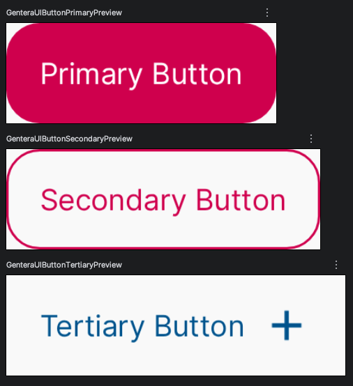

# Gentera UI Design System 🎨✨

### 📌 Source of Truth

The Gentera UX Figma file can be found in [Design System Evolución](https://www.figma.com/files/1407742245893875276/project/505714474?fuid=1585110440822450563)

- **The above Figma is the single source of truth**
- All values (typography, spacing, radius, borders) come directly from design charts
- No values should be invented nor hardcoded

### 🔄 Mapping Rules
| Figma                             | Android   | Why                     |
|-----------------------------------|-----------|-------------------------|
| Text sizes (px)                   | `sp`      | Accessibility scaling ♿ |
| Spacing / Radius / Borders (px)   | `dp`      | Layout stability 📐 |


Gentera UI is a **Compose-first Android design system**, built as an **Android Library**, aligned with **Modern Android Development (MAD)** and **Clean Architecture** principles.

This document is the **authoritative reference** for all tokens, styles, and components exposed by the library.  
All tables below are **derived directly from code and XML definitions** (design tokens), not illustrative examples.

---

## 🎨 Color System

### Token layers
1. **Base palette** (`colors.xml`)
2. **Semantic mapping** (`colors_semantic.xml`)
3. **Runtime model** (`GenteraUIThemeColorScheme`)
4. **Injection** via `CompositionLocal`

Components never access XML directly.

---

## 🎨 Semantic Color Tokens (Auto‑derived)

### Primary

| Semantic token | Base token | Hex |
|--------------|-----------|-----|
| backgroundPrimaryDefault | primary_default | `#D50057` |
| backgroundPrimarySoft | primary_soft | `#EF5292` |
| backgroundPrimaryStrong | primary_strong | `#910048` |

### Secondary

| Semantic token | Base token | Hex |
|--------------|-----------|-----|
| backgroundSecondaryDefault | secondary_default | `#FFA400` |
| backgroundSecondarySoft | secondary_soft | `#FFC463` |
| backgroundSecondaryStrong | secondary_strong | `#F57702` |

### Feedback

| Semantic token | Base token | Hex |
|--------------|-----------|-----|
| dangerDefault | danger_default | `#C11C12` |
| dangerStrong | danger_strong | `#8D0800` |
| dangerSoft | danger_soft | `#F7726A` |
| dangerSofter | danger_softer | `#FDE3E1` |

| Semantic token | Base token | Hex |
|--------------|-----------|-----|
| successDefault | success_default | `#35750F` |
| successStrong | success_strong | `#285413` |
| successSoft | success_soft | `#BEE28E` |
| successSofter | success_softer | `#E9F7D7` |

---

## 🌈 Gradients (Auto‑derived)

| Gradient | Start | Mid | End |
|--------|-------|-----|-----|
| Soft | `#FEFDFD` | `#FBE8EE` / `#FFF5EA` | `#FFFDFE` |
| Primary Soft | `#CE0058` | — | `#FBE8EE` |
| Primary Strong | `#CE0058` | — | `#910048` |
| Primary + Secondary | `#CE0058` | — | `#FFA400` |

---

## 🔵 Radius Tokens

| Token | Value |
|------|------|
| none | `0.dp` |
| xxSm | `2.dp` |
| xSm | `4.dp` |
| sm | `8.dp` |
| md | `16.dp` |
| lg | `24.dp` |
| xLg | Circle / Pill |

---

## 🧱 Border Weights

| Token | Value |
|------|------|
| none | `0.dp` |
| md | `1.dp` |
| lg | `2.dp` |

---

## 📐 Spacing Tokens

| Token | Dp |
|------|----|
| none | 0 |
| xxxSm | 2 |
| xxSm | 4 |
| xSm | 8 |
| sm | 12 |
| md | 16 |
| lg | 20 |
| xLg | 24 |
| xxLg | 32 |
| xxxLg | 40 |
| huge | 56 |
| xHuge | 64 |
| xxHuge | 80 |
| xxxHuge | 120 |

---

## 🔤 Font Families

| Family | File type | Usage |
|------|-----------|------|
| Bree | OTF | Display / Headings |
| Inter | TTF | Body / Captions / Links |

---

## ✍️ Typography Sizes (Auto‑derived)

### Display (Bree)

| Scale | h1 | h2 | h3 | h4 | h5 |
|------|----|----|----|----|----|
| Small | 40sp | 32sp | 26sp | 22sp | 18sp |
| Medium | 48sp | 40sp | 34sp | 28sp | 22sp |
| Large | 64sp | 56sp | 48sp | 40sp | 32sp |
| X‑Large | 72sp | 64sp | 56sp | 48sp | 40sp |

### Body (Inter)

| Scale | Large | Medium | Small |
|------|-------|--------|-------|
| Small | 18sp | 16sp | 14sp |
| Medium | 18sp | 16sp | 14sp |
| Large | 18sp | 16sp | 14sp |
| X‑Large | 20sp | 18sp | 16sp |

---

### ✍️ Text Styles (Semantic)

```kotlin
Text(
    text = "Title",
    style = GenteraUITextStyles.h1
)
```

Available:
- 🅱️ `h1 … h5` (Bree)
- 🆎 `bodyLarge | bodyMedium | bodySmall` (Inter)
- 🏷️ `captionSmall | captionMedium`
- 🔗 `linkSmall | linkMedium | linkLarge`

Consumers never deal with font files or weights directly.

---

## ✅ Example Usage

```kotlin
GenteraUiTheme(windowWidthSizeClass) {
    Column(
        modifier = Modifier.padding(GenteraUISpacing.md)
    ) {
        Text(
            text = "Title",
            style = GenteraUITextStyles.h2
        )

        Text(
            text = "Body",
            style = GenteraUITextStyles.bodyMediumRegular
        )
    }
}
```

## 🔘 Buttons

### Variants

| Variant | Description |
|-------|-------------|
| Primary | Filled, main action |
| Secondary | Outlined |
| Tertiary | Text / icon action |

### Button States (Auto‑derived)

#### Primary

| State | Background | Text | Icon | Border |
|------|------------|------|------|--------|
| Default | `#D50057` | `#FFFFFF` | `#FFFFFF` | — |
| Hover | `#910048` | `#FFFFFF` | `#FFFFFF` | — |
| Pressed | `#EF5292` | `#FFFFFF` | `#FFFFFF` | — |
| Disabled | `#D8DADA` | `#5E6A71` | `#798388` | — |

#### Secondary

| State | Background | Text | Icon | Border |
|------|------------|------|------|--------|
| Default | Transparent | `#D50057` | `#D50057` | `#D50057` |
| Hover | Transparent | `#910048` | `#910048` | `#910048` |
| Pressed | `#FFE0EC` | `#D50057` | `#D50057` | `#D50057` |
| Disabled | Transparent | `#5E6A71` | `#798388` | `#798388` |

#### Tertiary

| State | Background | Text | Icon |
|------|------------|------|------|
| Default | Transparent | `#005D97` | `#005D97` |
| Hover | Transparent | `#06304B` | `#06304B` |
| Pressed | Transparent | `#33BBE0` | `#33BBE0` |
| Disabled | Transparent | `#5E6A71` | `#798388` |

---

### Button Sizes

| Size | Height |
|----|--------|
| Small | Compact |
| Medium | Default |
| Large | Expanded |

Resolved via `GenteraUIButtonSizeResolver`.

---

### Example

```kotlin
GenteraUIButton(
    variant = GenteraUIButtonVariant.Primary,
    onClick = { }
) {
    Text("Primary Button")
}
```

---

### 📸 Button Previews


---

## 🧪 Previews & Tooling

- All previews live in `src/debug`
- Tooling added via `debugImplementation`
- No preview code is shipped in release artifacts

---

## 🏗 Architecture Principles

- Compose‑first
- Runtime theming
- No XML access in components
- Token → Resolver → Component flow
- Clean Architecture compliant

---

**Gentera UI** — a scalable, future‑proof Android design system.
